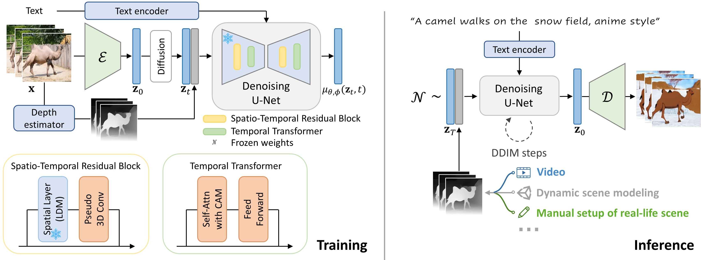

## **Make-Your-Video**
> **Make-Your-Video: Customized Video Generation Using Textual and Structural Guidance**
>
>
> <a href=''></a> <a href='https://doubiiu.github.io/projects/Make-Your-Video/'></a>

## **Abstract**
TL;DR: Make-Your-Video is a customized video generation model with both text and motion structure (depth) control. It inherits rich visual concepts from image LDM and supports longer video inference.
>Creating a vivid video from the event or scenario in our imagination is a truly fascinating experience. Recent advancements in text-to-video synthesis have unveiled the potential to achieve this with prompts only. While text is convenient in conveying the overall scene context, it may be insufficient to control precisely. In this paper, we explore customized video generation by utilizing text as context description and motion structure (e.g. frame-wise depth) as concrete guidance.
Our method, dubbed Make-Your-Video, involves joint-conditional video generation using a Latent Diffusion Model that is pre-trained for still image synthesis and then promoted for video generation with the introduction of temporal modules. This two-stage learning scheme not only reduces the computing resources required, but also improves the performance by transferring the rich concepts available in image datasets solely into video generation. Moreover, we use a simple yet effective causal attention mask strategy to enable longer video synthesis, which mitigates the potential quality degradation effectively.
Experimental results show the superiority of our method over existing baselines, particularly in terms of temporal coherence and fidelity to users' guidance. In addition, our model enables several intriguing applications that demonstrate potential for practical usage.

## **Method Overview**
<p align="center">

</p>

## **Results (Please check the [project page](https://doubiiu.github.io/projects/Make-Your-Video/) for more results)**
### Conditional text-to-video generation
<table class="center" style="text-align:center;">
  <!-- <td style="text-align:center;" width="50">Input Text</td> -->
  <td colspan="2">"Three red tomatos on the brunch"</td>
  <td colspan="2">"astronaut riding a horse"</td>
  <td colspan="2">"A glass bead falling into water with a huge splash. Sunset in the background"</td>
  <tr>
  <td>
    <video autoplay="" loop="" muted="" playsinline="" width="170">
      <source src="./assets/video_16_depth/007451_007500__14878396.mp4" type="video/mp4">
    </video>
  </td>
  <td>
    <video autoplay="" loop="" muted="" playsinline="" width="170">
      <source src="./assets/video_16/007451_007500__14878396.mp4" type="video/mp4">
    </video>
  </td>

  <td></td>
  <td></td>
  <td></td>
  <td></td>
</tr>
</table >


## **Applications**
### Real-life scene to video


### 3D scene modeling to video


### Video re-rendering

## **Changelog**
- 2023.06.01 Create this repo and launch the project webpage.

<!-- ## **Citation**

```

```
-->
## **Acknowledgement**
We gratefully acknowledge the Visual Geometry Group of University of Oxford for collecting the [WebVid-10M](https://m-bain.github.io/webvid-dataset/) dataset and follow the corresponding terms of access.
